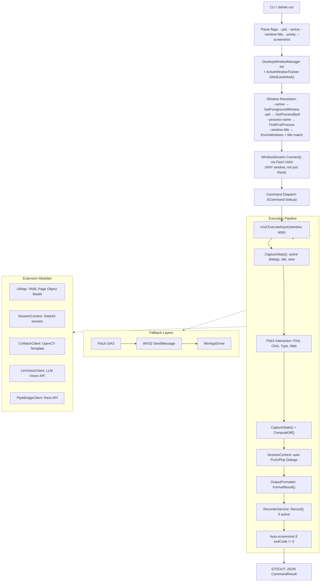
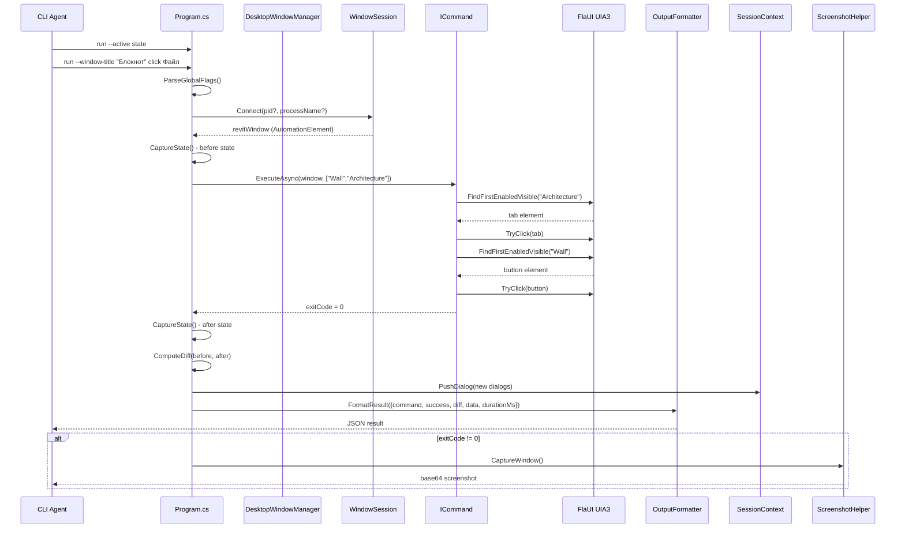
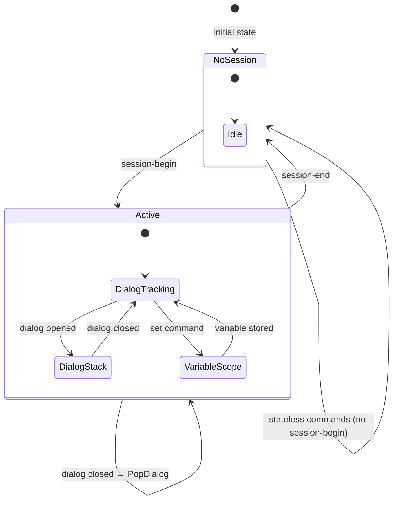
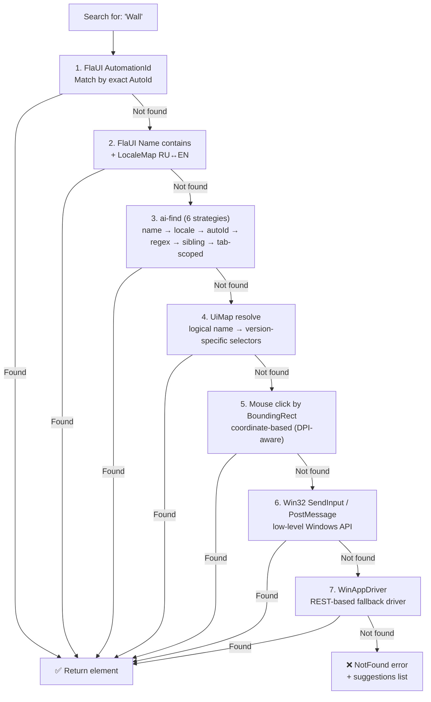
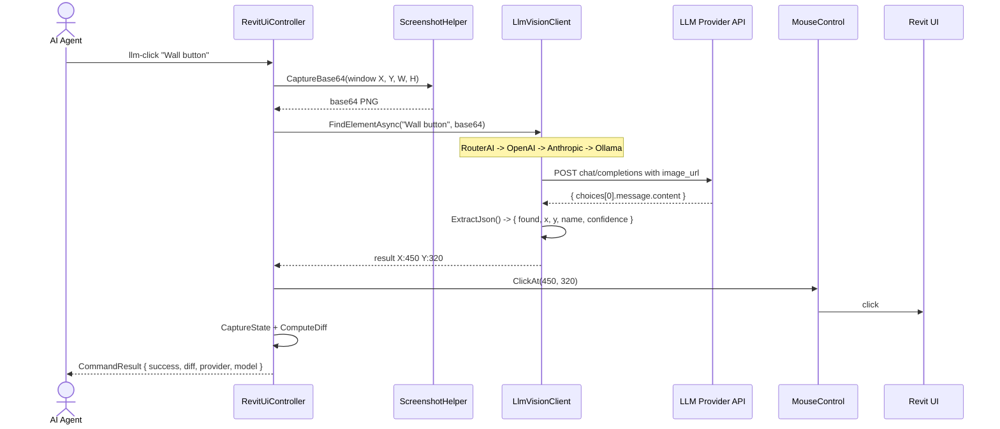
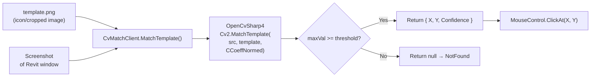

# RevitUiController

**CLI-инструмент для программного управления Windows-приложениями через UI Automation (FlaUI UIA3).**

Поддерживает **любые окна** (не только Revit): переключение между окнами, работа с активным окном, мультимонитор. Позволяет AI-агентам и CI-сценариям выполнять действия: нажимать кнопки, заполнять диалоги, переключать виды, читать состояние UI, выполнять Revit API команды — без необходимости смотреть на экран.

---

## Быстрый старт

```powershell
# Собрать
dotnet build tools\RevitUiController -c Release

# Убедиться что Revit запущен, выполнить команду
dotnet run --project tools\RevitUiController -- state --pretty
dotnet run --project tools\RevitUiController -- ribbon "Wall" Architecture --pretty
dotnet run --project tools\RevitUiController -- ai-find "Стена" --deep --pretty
```

**Требования:** Revit (любая версия 2022–2027), .NET 10 SDK

---

## Установка

```powershell
git clone <repo-url>
cd tools/RevitUiController
dotnet restore
dotnet build -c Release
```

Бинарник: `bin/Release/net10.0-windows/RevitUiController.dll`

Можно запускать напрямую:

```powershell
dotnet run --project tools\RevitUiController -- <command> [args] [--flags]
```

---

## Глобальные флаги

| Флаг | Описание |
|------|----------|
| `--pretty` | Pretty-print JSON (человекочитаемый) |
| `--screenshot` | Включить base64 скриншот в `CommandResult.Screenshot` |
| `--verbosity minimal\|normal\|full` | Степень детальности ответа |
| `--pid <number>` | Подключиться к конкретному процессу по PID |
| `--process-name <name>` | Имя процесса (по умолчанию: `Revit`) |
| `--window-title <title>` | Подключиться к окну по заголовку (contains) |
| `--active` | Подключиться к текущему активному (foreground) окну |
| `--connect-timeout <sec>` | Таймаут ожидания процесса (по умолчанию: 30 с) |
| `--non-interactive` | CI-режим: все деструктивные действия автоматически отклоняются |

---

## Команды (полный справочник)

### 🖥️ Desktop Window Management (любые окна)

```powershell
list-all (la) [--filter <text>]       # Список ВСЕХ visible top-level окон рабочего стола
active                                  # Инфо о текущем активном окне + монитор
focus <title> [--pid <N>|--hwnd <hex>] # Переключиться на окно (bring to foreground)
monitors                                # Список мониторов: разрешение, DPI, work area, primary
```

**Примеры:**

```powershell
# Список всех окон
dotnet run --project tools\RevitUiController -- list-all --pretty

# Фильтр по процессу
dotnet run --project tools\RevitUiController -- list-all --filter notepad --pretty

# Инфо об активном окне
dotnet run --project tools\RevitUiController -- active --pretty

# Работа с любым окном по заголовку
dotnet run --project tools\RevitUiController -- --window-title "Блокнот" list-controls

# Работа с текущим активным окном
dotnet run --project tools\RevitUiController -- --active info

# Переключиться на окно
dotnet run --project tools\RevitUiController -- focus "Блокнот"

# Список мониторов
dotnet run --project tools\RevitUiController -- monitors --pretty
```

### 🧩 UIA Pattern Tools (чтение UI без скриншотов)

Команды для чтения и взаимодействия с любыми WPF/WinForms контролами через UIA-паттерны — без скриншотов, без LLM Vision, без OpenCV.

```powershell
patterns <name>                           # Показать все UIA-паттерны элемента:
                                          #   Invoke, Toggle, ExpandCollapse, SelectionItem,
                                          #   Value, RangeValue, Grid, Table, Scroll, Text, ...

dump-patterns [depth] [--type <ct>]      # Дампить UIA-дерево с паттернами у каждого элемента
  [--filter-name <name>]

tree-expand <name> [--all] [--depth N]   # Развернуть TreeView-узел и рекурсивно дампить всю ветку

combo-read (cr) <name>                    # Открыть ComboBox, прочитать ВСЕ items, закрыть

grid-read (gr) <name> [--rows N]          # Прочитать DataGrid через GridPattern:
                                          #   строки × колонки, structured data

list-items (li) <name> [--max N]          # Прочитать все ListBox/ListView items

table-read (tr) <name> [--rows N]         # Прочитать Table с column headers

scroll-to <name> [--parent <p>]           # ScrollIntoView — прокрутить к элементу

invoke <name>                             # Вызвать InvokePattern (надёжнее Click для кнопок)

toggle <name> [on|off]                    # Переключить checkbox/switch через TogglePattern

set-value <name> <text>                   # Установить текст через ValuePattern (надёжнее type)
```

**Примеры:**

```powershell
# Узнать, что можно сделать с элементом
dotnet run --project tools\RevitUiController -- patterns "OK" --pretty
# → { patterns: ["Invoke", "Value"], canInvoke: true, value: "OK" }

# Прочитать все записи ComboBox
dotnet run --project tools\RevitUiController -- combo-read "Этаж" --pretty
# → { selectedValue: "Level 1", items: ["Level 1", "Level 2", "Level 3", ...] }

# Прочитать DataGrid структурированно
dotnet run --project tools\RevitUiController -- grid-read "Спецификация" --rows 20 --pretty
# → { dimensions: {rows: 45, columns: 8}, rows: [...] }

# Invoke-клик (не Mouse Click)
dotnet run --project tools\RevitUiController -- invoke "OK"

# Toggle чекбокса
dotnet run --project tools\RevitUiController -- toggle "Structural Wall" on

# Установка значения через ValuePattern (без эмуляции клавиатуры)
dotnet run --project tools\RevitUiController -- set-value "Height" "3000"
```

### 🔍 Advanced Search & Watch

```powershell
find-all (fa) <name> [--max N]            # Найти ВСЕ совпадения, не только первое
  [--type <ct>]

watch <command> [args...]                  # Поллинг команды до выполнения условия
  --until <condition>                       #   found — команда успешна
  [--interval <sec>]                       #   gone — команда не успешна
  [--timeout <sec>]                        #   text:substring — вывод содержит текст
```

**Примеры:**

```powershell
# Найти все кнопки "OK"
dotnet run --project tools\RevitUiController -- find-all "OK" --max 10 --pretty

# Ждать пока появится диалог
dotnet run --project tools\RevitUiController -- watch find "Modify | Walls" --until found --interval 1 --timeout 30

# Ждать пока закроется диалог
dotnet run --project tools\RevitUiController -- watch find "Processing..." --until gone --interval 2 --timeout 60

# Ждать пока в выводе появится текст
dotnet run --project tools\RevitUiController -- watch state --until "text:Modify | Walls" --interval 1 --timeout 15
```

### ⌨️ Keyboard & Clipboard

```powershell
key-combo (kc) <keys>                     # Отправить хоткей:
                                          #   ^c = Ctrl+C, ^v = Ctrl+V
                                          #   %{F4} = Alt+F4
                                          #   {TAB} = Tab, {ENTER} = Enter
                                          #   ^+s = Ctrl+Shift+S
clipboard-get (cg)                        # Прочитать текст из буфера обмена
clipboard-set (cs) <text>                 # Записать текст в буфер обмена
```

**Примеры:**

```powershell
# Ctrl+Shift+S (Save As)
dotnet run --project tools\RevitUiController -- key-combo "^+s"

# Копировать выделенный текст в буфер
dotnet run --project tools\RevitUiController -- key-combo "^c"
dotnet run --project tools\RevitUiController -- clipboard-get --pretty

# Вставить из буфера
dotnet run --project tools\RevitUiController -- clipboard-set "3000"
dotnet run --project tools\RevitUiController -- key-combo "^v"
```

### 🖼️ Region Tools

```powershell
screenshot-region (sr) <x> <y> <w> <h>    # Скриншот области экрана
highlight-region (hr) <x> <y> <w> <h>     # Подсветка области красным overlay
  [ms]                                      #   длительность в мс (по умолч. 2000)
```

**Примеры:**

```powershell
# Скриншот области (левого верхнего угла)
dotnet run --project tools\RevitUiController -- screenshot-region 0 0 800 600 --screenshot

# Подсветить найденный элемент на 3 секунды
dotnet run --project tools\RevitUiController -- highlight-region 100 200 300 50 3000
```

### 🔍 UI Exploration

```powershell
list-windows (lw)                     # Список всех окон/диалогов Revit
list-controls (lc) [window]           # Контролы в окне (дерево до 5 ур.)
find <name>                           # Поиск контрола по имени, возвращает bounds, enabled, visible
dump [depth] [-f <file>] [-t <type>]  # Полный дамп UIA-дерева (фильтр по ControlType)
inspect [index-path]                  # Инспекция элемента как Spy++ (e.g. inspect 37 0)
state                                 # Быстрый снапшот UI: активное окно, диалоги, таб
info                                  # Информация о главном окне Revit
```

### 🖱️ Navigation & Interactions

```powershell
click <name>                          # Нажать кнопку/контрол по имени
safe-click <name>                     # Идемпотентный клик (OK если уже нет)
ribbon <button> [tab]                 # Нажать кнопку на ленте (с переключением таба)
ribbon <button> --tab <tab>          # Явное указание таба через флаг
type <control> <text>                 # Ввести текст в контрол
switch-view (sv) <view-name>          # Переключить вкладку вида
expand                                # Развернуть "Подробности" в диалоге
dropdown <btn> <item> [tab]           # SplitButton → выбрать пункт меню
```

### 📋 PropertySheet (диалоги свойств)

```powershell
ps <title> fields                     # Прочитать все поля диалога
ps <title> tabs                       # Список вкладок диалога
ps <title> type <label> <value>       # Ввести значение в поле по лейблу
ps <title> check <label> [true/false] # Установить/прочитать CheckBox
ps <title> select <label> <option>    # Выбрать значение в ComboBox
ps <title> click <button>             # Нажать кнопку (OK/Cancel/Apply)

# BATCH — заполнить множество полей из JSON (новое!)
ps-batch <title> <json> [--tab <t>]   # Пример:
ps-batch "Modify | Walls" '{"Height":"3000","Level":"Level 2","Structural Wall":false}'
```

### 💬 TaskDialog

```powershell
taskdialog <title> read               # Прочитать заголовок, сообщение, футер
taskdialog <title> click <button>     # Нажать кнопку (Да/Нет/OK/Отмена)
taskdialog <title> expand             # Развернуть "Показать подробности"
```

### 🎯 Smart Search (новое!)

```powershell
ai-find <query> [--type <ct>] [--parent <p>] [--tab <t>] [--deep] [--max N]
```

Многостратегический поиск элемента. Стратегии (в порядке приоритета):
1. **Name** — `FindFirstEnabledVisible` (exact → startsWith → contains)
2. **Locale** — перевод через `LocaleMap` (RU ↔ EN)
3. **AutomationId** — поиск по AutomationId всего дерева
4. **Regex** — `Regex.IsMatch(element.Name, query, IgnoreCase)`
5. **Sibling** — элементы на том же Y-уровне (только с `--deep`)
6. **Tab-scoped** — переключение таба и поиск

Без `--deep` останавливается на первой стратегии с результатами.
С `--deep` прогоняет все. Возвращает ранжированный список кандидатов.

```powershell
# Пример
dotnet run --project tools\RevitUiController -- ai-find "Wall" --type Button --deep --pretty
```

### 🏷️ Ribbon Tools

```powershell
ribbon-tabs (rt) [tab-name]           # Список табов (или кнопки конкретного таба)
rb [tab-name]                         # Deep scan: все табы → панели → кнопки
ribbon-find <tab> [panel [btn]]       # Найти и показать локацию
ribbon-panel <tab> [panel]            # Кнопки на конкретной панели
context-tabs                          # Контекстные табы (Modify | Walls, ...)
qat [click <name>]                    # Quick Access Toolbar
```

### ⏱️ Waiting & Retry

```powershell
wait <seconds>
wait-for <title> [timeout]            # Дождаться появления диалога (таймаут в сек)
wait-close <title> [timeout]          # Дождаться закрытия диалога
wait-element <name> [timeout]         # Дождаться появления элемента
wait-progress [timeout]               # Дождаться завершения ProgressBar
```

### ✅ Assertions

```powershell
assert-dialog <title> exists           # Диалог открыт
assert-dialog <title> text <expected>  # Текст внутри диалога
assert-dialog <title> button <name>    # Кнопка существует
assert-dialog <title> enabled <name>   # Кнопка активна
assert-dialog <title> field <l> <v>    # Поле содержит значение
assert-ribbon <tab>                    # Таб существует
assert-ribbon <tab> button <name>      # Кнопка на табе есть
assert-view <name>                     # Вкладка вида активна
```

### 🖱️ Mouse & Canvas

```powershell
mouse-click <x> <y>                   # Клик по координатам (DPI-aware)
mouse-drag <x1> <y1> <x2> <y2>       # Drag from-to
mouse-scroll <ticks>                  # Scroll wheel
mouse-pos                             # Позиция курсора
mouse-type <text>                     # SendKeys (через активный элемент)
canvas-click <x> <y> [--relative]    # Клик на GraphicsView
canvas-drag <x1> <y1> <x2> <y2>      # Drag на GraphicsView
canvas-zoom <factor>                  # Zoom колесом над GraphicsView
canvas-screenshot                     # Скриншот GraphicsView
```

### 🖼️ Computer Vision (OpenCV MatchTemplate)

```powershell
cv-match <template.png> [--region x,y,w,h] [--threshold 0.8]  # Найти шаблон на скриншоте Revit
cv-click <template.png> [--threshold 0.8]                      # Найти шаблон и кликнуть
cv-templates [filter]                                           # Список доступных шаблонов
```

Ищет .png шаблоны в: `./templates/`, `./cv-templates/`, `%LOCALAPPDATA%/ReVibe/UiController/templates/`.

```powershell
# Пример: найти иконку "Стена" по скриншоту и кликнуть
cv-click wall-icon.png --threshold 0.75 --pretty
```

### 🤖 LLM Vision (AI-powered)

```powershell
llm-find <description> [--region x,y,w,h] [--provider <p>] [--model <m>]  # Найти элемент по описанию
llm-click <description> [--provider <p>] [--model <m>]                     # Найти и кликнуть
```

Провайдеры (автовыбор по приоритету, если ключ установлен):
1. **RouterAI** — `ROUTERAI_API_KEY`, модель `qwen/qwen-vl-max`
2. **OpenAI** — `OPENAI_API_KEY`, модель `gpt-4o`
3. **Anthropic** — `ANTHROPIC_API_KEY`, модель `claude-sonnet-4-20250514`
4. **Ollama** (локально, бесплатно) — `llama3.2-vision`

```powershell
# Пример: найти кнопку "Стена" по описанию и кликнуть
llm-click "The Wall button on the Architecture tab" --pretty

# Сужение региона для точности
llm-find "OK button in the bottom-right corner" --region 800,400,400,200 --provider openai --pretty
```

### 🔌 Revit API Bridge (через Named Pipe)

```powershell
revit-api <cmd> [--payload <json>]    # Выполнить Revit API команду
revit-select <id> [id ...]            # Выбрать элементы по ID
revit-get views                       # Список открытых видов
revit-get elements                    # Элементы из активного вида
revit-get categories                  # Категории
revit-get views                       # Виды
revit-api getParameter --payload '{"elementId":123,"paramName":"Height"}'  # Прочитать параметр
revit-api setParameter --payload '{"elementId":123,"paramName":"Height","value":"3000"}'  # Установить
```

### 📜 Scripts & Recording

```powershell
script <file.rvs>                     # Выполнить скрипт
dry-run <file.rvs>                    # Симуляция скрипта без реальных кликов
record-start <path>                   # Начать запись действий в .rvs
record-stop                           # Остановить запись
record-save [--path <p>] [--diff]    # Сохранить запись без остановки (с git diff)
record-status                         # Статус записи
script-list (sl) [--path <d>] [--git] # Список .rvs файлов
script-log (slog) [--file <p>] [--last N] # Git log для скриптов
script-diff (sdiff) [--file <p>] [--commit <h>]  # Git diff для скриптов
```

### 🗺️ UI Map (Page Object Model) — новое!

```powershell
uimap-load [path]                     # Загрузить YAML-карту UI
uimap-save [path]                     # Сохранить карту в YAML
uimap-resolve <name> [--version Y]    # Разрешить логическое имя в селекторы
uimap-register <name> --auto-id <id>  # Зарегистрировать entry (AutoId/Name/Tab)
uimap-list [filter]                   # Список всех entry
uimap-auto <name> <element-name>      # Найти элемент в Revit, извлечь селекторы, зарегистрировать
```

YAML-формат:
```yaml
entries:
  WallButton:
    automationId: RibbonButton_Wall
    name: Стена
    tab: Архитектура
    fallbacks: [Wall, Стена, Создание стены]
    versions:
      "2025": { automationId: RibbonButton_Wall_2025 }
```

Авто-загрузка при старте из: `./uimap.yaml`, `./config/uimap.yaml`, `%LOCALAPPDATA%/ReVibe/UiController/uimap.yaml`

### ⚡ Stateful Session — новое!

```powershell
session-begin [--dialog <title>] [--tab <tab>]  # Начать сессию
session-end                                       # Закончить сессию
session-status                                    # Контекст: диалог, таб, переменные, стек
```

При активной сессии:
- `type`, `ps`, `taskdialog` без указания диалога авто-скопятся на `ActiveDialog`
- `click`/`safe-click` в скриптах авто-скопятся на `ActiveDialog`
- Переменные сессии: `set varName value`, `$varName` подстановка
- `get-output varName` — сохранить результат последней команды в переменную

### 🔄 Fallback-слои

```powershell
win32-click <name>                    # Win32 SendMessage fallback
win32-enum                            # Перечислить Win32-окна
wad-connect                           # Подключиться к WinAppDriver
wad-find <method> <value>             # Найти элемент через WinAppDriver
wad-click <element-id>                # Клик через WinAppDriver
```

### 🛡️ Safety & Diagnostics

```powershell
safety-check                          # Проверить/закрыть неожиданные warning-диалоги
revit-restart [--path <exe>]          # Запустить Revit если не запущен
process-list                          # Список Revit-процессов (PID, окно, версия)
process-info                          # Детали подключенного процесса
logs [--tail N] [--level L]           # Логи контроллера/плагина
statusbar                             # Текст статус-бара Revit
highlight <name> [ms]                 # Подсветить элемент (полупрозрачный overlay)
highlight-clear                       # Снять подсветку
cache-clear                           # Очистить кэш элементов
cache-stats                           # Статистика кэша
cached-find <name>                    # Поиск с кэшем (TTL 5s)
```

---

## 📁 .rvs — Script Format

Файл скрипта: одна команда на строку, `#` — комментарий.

**Директивы:**

| Директива | Описание |
|-----------|----------|
| `wait-for "Title" [sec]` | Дождаться появления диалога |
| `wait-close "Title" [sec]` | Дождаться закрытия диалога |
| `window "Title"` | Установить активный диалог для последующих команд |
| `set <var> <value>` | Установить переменную сессии |
| `get-output <var>` | Сохранить результат последней команды в `$var` |
| `select "Label" "Option"` | Выбрать значение в ComboBox |

**Пример `scripts/create-wall.rvs`:**

```rvs
# Сценарий: создать стену
session-begin
ribbon Wall Architecture
wait-for "Modify | Walls" 15
ps type "Height" 3000
select "Level" "Level 2"
check "Structural Wall" false
set wallResult "created"
ps click OK
wait-close "Modify | Walls" 10
session-end
```

---

## 🧠 Agent Interface

Все команды возвращают JSON в едином формате `CommandResult`:

```json
{
  "command": "ribbon",
  "success": true,
  "diff": {
    "activeDialog": "Modify | Walls",
    "newDialogs": ["Modify | Walls"],
    "closedDialogs": [],
    "activeTabChanged": true
  },
  "data": { "button": "Wall", "tab": "Architecture" },
  "durationMs": 1234
}
```

**Ключевые особенности для агентов:**

1. **State diff** — после каждого действия: какие диалоги открылись/закрылись
2. **Auto-screenshot** — при ошибке (exitCode != 0) автоматически прикладывается base64 скриншот
3. **Self-describing errors** — `ai-find` возвращает `{code, query, suggestions}` при ненахождении
4. **Verbosity control** — `minimal` (только success/diff), `normal` (+ данные), `full` (+ весь dump)
5. **Idempotence** — `safe-click` не падает если элемент уже исчез
6. **CancellationToken** — Ctrl+C прерывает любую команду (все команды принимают `CancellationToken`)
7. **CI mode** — `--non-interactive` для автоматического отклонения деструктивных действий
8. **Safe logging** — все UIA-операции логируют исключения вместо молчаливого `catch {}`

---

## 🏗️ Architecture

### High-level System Overview



### Command Execution Flow



### Session State Machine



### Element Search Hierarchy



### LLM Vision Flow



### OpenCV Template Matching Flow



---

```
RevitUiController/
├── Program.cs                          # CLI entry, регистрация команд, парсинг флагов
├── RevitSession.cs                     # Подключение к Revit через FlaUI (legacy)
├── WindowSession.cs                    # Подключение к ЛЮБОМУ окну через FlaUI
├── DesktopWindowManager.cs             # Оркестратор: поиск окон, переключение, мониторы
├── ActiveWindowTracker.cs              # WinEventHook + фоновое отслеживание активного окна
├── NativeMethods.cs                    # Win32 P/Invoke: EnumWindows, SetWinEventHook и др.
├── AutomationHelper.cs                 # Утилиты: поиск, SafeGetChildren, Tokenize
├── OutputFormatter.cs                  # JSON-форматирование ответов (CommandResult)
├── SessionContext.cs                   # Stateful session (dialog, tab, variables, stack)
├── UiMap.cs                            # Page Object Model (YAML)
├── ElementCache.cs                     # Кэш элементов (TTL 5s)
├── LocaleMap.cs                        # RU↔EN словарь
├── RevitVersionProfile.cs              # Версия Revit → профиль селекторов
├── RecorderService.cs                  # Запись действий в .rvs
├── LoggingService.cs                   # Структурированное логирование в файл
├── Retry.cs / FlakyRetry.cs            # Polling с таймаутом / экспоненциальный backoff
├── SafetyGuard.cs                      # Защита от деструктивных действий
├── HighlightHelper.cs                  # Полупрозрачный overlay для подсветки
├── ScreenshotHelper.cs                 # Скриншоты (окно/регион/base64)
├── MouseControl.cs                     # Mouse-click, drag, scroll (DPI-aware)
├── Win32Helper.cs                      # Win32 SendInput/PostMessage fallback
├── WinAppDriverClient.cs               # WinAppDriver REST API клиент
├── PipeBridgeClient.cs                 # Named Pipe клиент для Revit API
├── Models/
│   ├── WindowInfo.cs                   # Метаданные окна: hWnd, title, PID, bounds, монитор
│   ├── MonitorInfo.cs                  # Информация о мониторе: разрешение, DPI, work area
│   └── WindowQuery.cs                  # Параметры поиска окна (PID/name/title/active)
└── Commands/
    ├── ActiveCommand.cs                # active — активное окно + монитор
    ├── AiFindCommand.cs                # Многостратегический поиск (6 стратегий)
    ├── AllureConfigCommands.cs          # Allure-отчёты
    ├── AssertCommands.cs                # assert-dialog, assert-ribbon, assert-view
    ├── BatchCommands.cs                 # ps-batch (PropertySheet batch-fill)
    ├── CacheCommands.cs                 # cached-find, cache-clear, cache-stats
    ├── CanvasCommands.cs                # canvas-click, canvas-drag, canvas-zoom, canvas-screenshot
    ├── ClipboardCommands.cs             # clipboard-get, clipboard-set
    ├── ComboReadCommand.cs              # combo-read (cr) — читать ComboBox items
    ├── DialogCommands.cs                # ps (PropertySheet) — поля, checkbox, combobox, datagrid
    ├── DumpPatternsCommand.cs           # dump-patterns — UIA-дерево с паттернами
    ├── ExplorationCommands.cs           # list-windows, list-controls, find, dump, inspect, info
    ├── FindAllCommand.cs                # find-all (fa) — найти все совпадения
    ├── FocusCommand.cs                  # focus — переключение на окно
    ├── GridReadCommand.cs               # grid-read (gr) — читать DataGrid через GridPattern
    ├── HighlightCommand.cs              # highlight, highlight-clear
    ├── InteractionCommands.cs           # click, ribbon, switch-view, type, expand, ribbon-tabs, rb
    ├── InvokeCommand.cs                 # invoke — InvokePattern
    ├── KeyComboCommand.cs               # key-combo (kc) — SendKeys хоткеи
    ├── ListAllWindowsCommand.cs         # list-all — все окна рабочего стола
    ├── ListItemsCommand.cs              # list-items (li) — читать ListBox/ListView
    ├── LogCommands.cs                   # logs
    ├── MonitorsCommand.cs               # monitors — список мониторов
    ├── MouseCommands.cs                 # mouse-click, mouse-drag, mouse-scroll, mouse-pos, mouse-type
    ├── PatternsCommand.cs               # patterns — UIA-паттерны элемента
    ├── ProcessCommands.cs               # process-list, process-info
    ├── RecorderCommands.cs              # record-start, record-stop, record-status, record-save
    ├── RegionCommands.cs                # screenshot-region, highlight-region
    ├── RetryCommands.cs                 # retry-click, retry-dialog
    ├── RevitApiCommand.cs               # revit-api, revit-select, revit-get
    ├── RibbonSmartCommands.cs           # ribbon-find, dropdown, context-tabs, qat, ribbon-panel
    ├── SafeClickCommand.cs              # safe-click
    ├── SafetyCommands.cs                # safety-check, revit-restart
    ├── ScriptCommands.cs                # script, dry-run
    ├── ScriptDiffCommands.cs            # script-list, script-log, script-diff
    ├── ScrollToCommand.cs               # scroll-to — ScrollIntoView
    ├── SessionCommands.cs               # session-begin, session-end, session-status
    ├── SetValueCommand.cs               # set-value — ValuePattern.SetValue
    ├── StateCommand.cs                  # state
    ├── StatusBarCommands.cs             # statusbar, wait-progress
    ├── TableReadCommand.cs              # table-read (tr) — читать Table с headers
    ├── TaskDialogCommand.cs             # taskdialog
    ├── ToggleCommand.cs                 # toggle — TogglePattern
    ├── TreeExpandCommand.cs             # tree-expand — развернуть TreeView
    ├── UiMapCommands.cs                 # uimap-load/save/resolve/register/list/auto
    ├── WaitForCommand.cs                # wait-for, wait-close, wait-element
    ├── WatchCommand.cs                  # watch — polling wrapper
    └── Win32Commands.cs                 # win32-click, win32-enum
```

### Иерархия поиска элементов

```
1. FlaUI UIA3 (AutomationId)           — самый быстрый и точный
2. FlaUI UIA3 (Name contains, LocaleMap RU/EN)
3. ai-find (6 стратегий: name → locale → autoId → regex → sibling → tab)
4. UiMap resolve (логическое имя → селекторы, version-specific)
5. Mouse-клик по координатам (BoundingRect, DPI-aware)
6. Win32 SendInput / PostMessage
7. WinAppDriver
```

---

## 🧪 Testing

```powershell
# xUnit-тесты (требуется запущенный Revit)
dotnet test tools\RevitUiController.Tests

# BDD-тесты (Reqnroll)
# .feature файлы в tools\RevitUiController.Tests\Reqnroll\Features\
```

---

## 🚀 GitHub Topics

`revit` `revit-api` `ui-automation` `flaui` `autodesk-revit` `testing` `cli` `csharp` `bim`

---

## License

MIT — свободно для использования, модификации и распространения.
