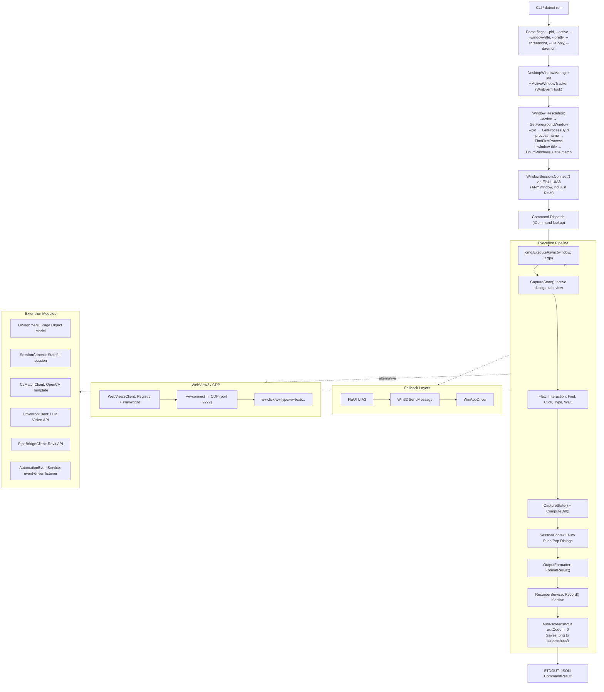
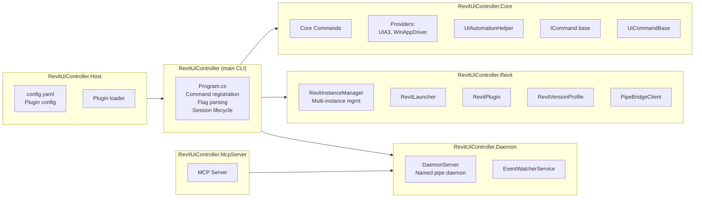
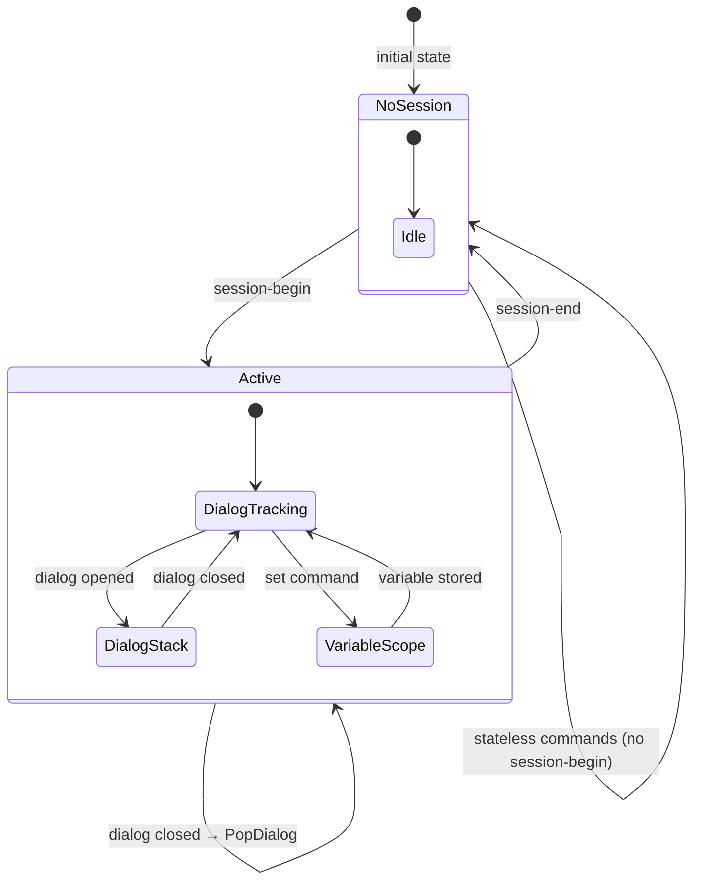
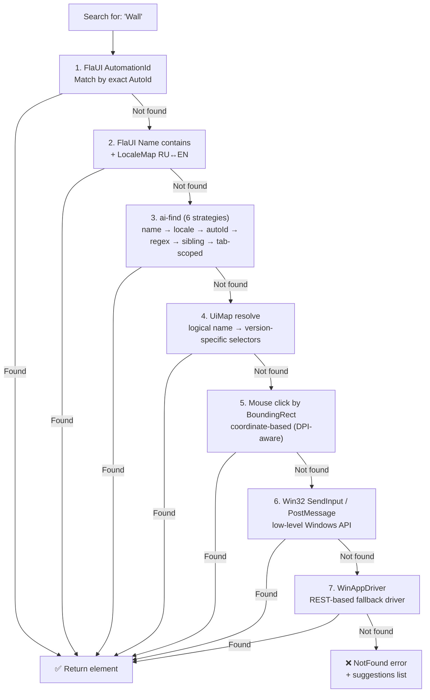

# RevitUiController

**CLI-инструмент для программного управления Windows-приложениями через UI Automation (FlaUI UIA3) + набор подпроектов для расширения.**

Поддерживает **любые окна** (не только Revit): переключение между окнами, работа с активным окном, мультимонитор. Позволяет AI-агентам и CI-сценариям выполнять действия: нажимать кнопки, заполнять диалоги, переключать виды, читать состояние UI, выполнять Revit API команды — без необходимости смотреть на экран.

---

## Быстрый старт

```powershell
# Собрать
dotnet build -c Release

# Убедиться что Revit запущен, выполнить команду
dotnet run -- state --pretty
dotnet run -- ribbon "Wall" Architecture --pretty
dotnet run -- ai-find "Стена" --deep --pretty
```

**Требования:** Revit (любая версия 2022–2027), .NET 10 SDK

---

## Решения (подпроекты)

| Проект | Описание |
|--------|----------|
| `RevitUiController` | Главный CLI — точка входа, все команды |
| `RevitUiController.Core` | Core-библиотека: провайдеры автоматизации (UIA3/WinAppDriver), протокол, команды Core, общие утилиты |
| `RevitUiController.Host` | Host-приложение с плагинами и конфигурацией (YAML) |
| `RevitUiController.Daemon` | Фоновый демон (named pipe сервер) — одно подключение для множества команд |
| `RevitUiController.McpServer` | MCP-сервер для интеграции с Model Context Protocol |
| `RevitUiController.Revit` | Revit-специфичный код: лаунчер, плагин, менеджер инстансов, pipe-клиент |

---

## Установка

```powershell
git clone <repo-url>
cd RevitUiController
dotnet restore
dotnet build -c Release
```

Бинарник: `bin/Release/net10.0-windows/RevitUiController.dll`

Можно запускать напрямую:

```powershell
dotnet run -- <command> [args] [--flags]
```

---

## Глобальные флаги

| Флаг | Описание |
|------|----------|
| `--pretty` | Pretty-print JSON (человекочитаемый) |
| `--screenshot` | Включить base64 скриншот в `CommandResult.Screenshot` |
| `--verbosity minimal\|normal\|full` | Степень детальности ответа |
| `--pid <number>` | Подключиться к конкретному процессу по PID |
| `--process-name <name>` | Имя процесса (по умолчанию: `Revit`) |
| `--window-title <title>` | Подключиться к окну по заголовку (contains) |
| `--active` | Подключиться к текущему активному (foreground) окну |
| `--connect-timeout <sec>` | Таймаут ожидания процесса (по умолчанию: 30 с) |
| `--non-interactive` | CI-режим: все деструктивные действия (click, ribbon, revit-api, win32-click, key-combo, type-text и команды с ключевыми словами delete/purge/remove/overwrite) автоматически отклоняются без промпта |
| `--uia-only` | UIA-only режим (без GDI/mouse_event для RDP/headless). Автоматически создаёт WinAppDriver-клиент |
| `--daemon` | Запустить демон (persistent-режим) |
| `--wv-setup` | Установить registry-ключ для WebView2 remote debugging (Chrome DevTools Protocol) |

---

## Команды (полный справочник)

### 🖥️ Desktop Window Management (любые окна)

```powershell
list-all (la) [--filter <text>]       # Список ВСЕХ visible top-level окон рабочего стола
active                                  # Инфо о текущем активном окне + монитор
focus <title> [--pid <N>|--hwnd <hex>] # Переключиться на окно (bring to foreground)
monitors                                # Список мониторов: разрешение, DPI, work area, primary
```

**Примеры:**

```powershell
dotnet run -- list-all --pretty
dotnet run -- list-all --filter notepad --pretty
dotnet run -- active --pretty
dotnet run -- --window-title "Блокнот" list-controls
dotnet run -- --active info
dotnet run -- focus "Блокнот"
dotnet run -- monitors --pretty
```

### 🧩 UIA Pattern Tools (чтение UI без скриншотов)

Команды для чтения и взаимодействия с любыми WPF/WinForms контролами через UIA-паттерны — без скриншотов, без LLM Vision, без OpenCV.

```powershell
patterns <name>                           # Показать все UIA-паттерны элемента

dump-patterns [depth] [--type <ct>]      # Дампить UIA-дерево с паттернами у каждого элемента
  [--filter-name <name>]

tree-expand <name> [--all] [--depth N]   # Развернуть TreeView-узел и рекурсивно дампить всю ветку

combo-read (cr) <name>                    # Открыть ComboBox, прочитать ВСЕ items, закрыть

grid-read (gr) <name> [--rows N]          # Прочитать DataGrid через GridPattern:
                                          #   строки × колонки, structured data

list-items (li) <name> [--max N]          # Прочитать все ListBox/ListView items

table-read (tr) <name> [--rows N]         # Прочитать Table с column headers

scroll-to <name> [--parent <p>]           # ScrollIntoView — прокрутить к элементу

invoke <name>                             # Вызвать InvokePattern (надёжнее Click для кнопок)

toggle <name> [on|off]                    # Переключить checkbox/switch через TogglePattern

set-value <name> <text>                   # Установить текст через ValuePattern (надёжнее type)
```

**Примеры:**

```powershell
dotnet run -- patterns "OK" --pretty
dotnet run -- combo-read "Этаж" --pretty
dotnet run -- grid-read "Спецификация" --rows 20 --pretty
dotnet run -- invoke "OK"
dotnet run -- toggle "Structural Wall" on
dotnet run -- set-value "Height" "3000"
```

### 🔍 Advanced Search & Watch

```powershell
find-all (fa) <name> [--max N]            # Найти ВСЕ совпадения, не только первое
  [--type <ct>]

watch <command> [args...]                  # Поллинг команды до выполнения условия
  --until <condition>                       #   found — команда успешна
  [--interval <sec>]                       #   gone — команда не успешна
  [--timeout <sec>]                        #   text:substring — вывод содержит текст
```

**Примеры:**

```powershell
dotnet run -- find-all "OK" --max 10 --pretty
dotnet run -- watch find "Modify | Walls" --until found --interval 1 --timeout 30
dotnet run -- watch find "Processing..." --until gone --interval 2 --timeout 60
dotnet run -- watch state --until "text:Modify | Walls" --interval 1 --timeout 15
```

### ⌨️ Keyboard & Clipboard

```powershell
key-combo (kc) <keys>                     # Отправить хоткей:
                                          #   ^c = Ctrl+C, ^v = Ctrl+V
                                          #   %{F4} = Alt+F4
                                          #   {TAB} = Tab, {ENTER} = Enter
                                          #   ^+s = Ctrl+Shift+S
clipboard-get (cg)                        # Прочитать текст из буфера обмена
clipboard-set (cs) <text>                 # Записать текст в буфер обмена
```

**Примеры:**

```powershell
dotnet run -- key-combo "^+s"
dotnet run -- key-combo "^c"
dotnet run -- clipboard-get --pretty
dotnet run -- clipboard-set "3000"
dotnet run -- key-combo "^v"
```

### 🖼️ Region Tools

```powershell
screenshot-region (sr) <x> <y> <w> <h>    # Скриншот области экрана
highlight-region (hr) <x> <y> <w> <h>     # Подсветка области красным overlay
  [ms]                                      #   длительность в мс (по умолч. 2000)
```

**Примеры:**

```powershell
dotnet run -- screenshot-region 0 0 800 600 --screenshot
dotnet run -- highlight-region 100 200 300 50 3000
```

### 🔍 UI Exploration

```powershell
list-windows (lw)                     # Список всех окон/диалогов Revit
list-controls (lc) [window]           # Контролы в окне (дерево до 5 ур.)
find <name>                           # Поиск контрола по имени
dump [depth] [-f <file>] [-t <type>]  # Полный дамп UIA-дерева (фильтр по ControlType)
inspect [index-path]                  # Инспекция элемента как Spy++
state                                 # Быстрый снапшот UI: активное окно, диалоги, таб
info                                  # Информация о главном окне Revit
```

### 🖱️ Navigation & Interactions

```powershell
click <name>                          # Нажать кнопку/контрол по имени
safe-click <name>                     # Идемпотентный клик (OK если уже нет)
ribbon <button> [tab]                 # Нажать кнопку на ленте (с переключением таба)
ribbon <button> --tab <tab>          # Явное указание таба через флаг
type <control> <text>                 # Ввести текст в контрол
switch-view (sv) <view-name>          # Переключить вкладку вида
expand                                # Развернуть "Подробности" в диалоге
dropdown <btn> <item> [tab]           # SplitButton → выбрать пункт меню
```

### 📋 PropertySheet (диалоги свойств)

```powershell
ps <title> fields                     # Прочитать все поля диалога
ps <title> tabs                       # Список вкладок диалога
ps <title> type <label> <value>       # Ввести значение в поле по лейблу
ps <title> check <label> [true/false] # Установить/прочитать CheckBox
ps <title> select <label> <option>    # Выбрать значение в ComboBox
ps <title> click <button>             # Нажать кнопку (OK/Cancel/Apply)

ps-batch <title> <json> [--tab <t>]   # Batch-fill нескольких полей из JSON
```

### 💬 TaskDialog

```powershell
taskdialog <title> read               # Прочитать заголовок, сообщение, футер
taskdialog <title> click <button>     # Нажать кнопку (Да/Нет/OK/Отмена)
taskdialog <title> expand             # Развернуть "Показать подробности"
```

### 🎯 Smart Search

```powershell
ai-find <query> [--type <ct>] [--parent <p>] [--tab <t>] [--deep] [--max N]
```

Многостратегический поиск элемента. Стратегии (в порядке приоритета):
1. **Name** — `FindFirstEnabledVisible` (exact → startsWith → contains)
2. **Locale** — перевод через `LocaleMap` (RU ↔ EN)
3. **AutomationId** — поиск по AutomationId всего дерева
4. **Regex** — `Regex.IsMatch(element.Name, query, IgnoreCase)`
5. **Sibling** — элементы на том же Y-уровне (только с `--deep`)
6. **Tab-scoped** — переключение таба и поиск

```powershell
dotnet run -- ai-find "Wall" --type Button --deep --pretty
```

### 🏷️ Ribbon Tools

```powershell
ribbon-tabs (rt) [tab-name]           # Список табов (или кнопки конкретного таба)
rb [tab-name]                         # Deep scan: все табы → панели → кнопки
ribbon-find <tab> [panel [btn]]       # Найти и показать локацию
ribbon-panel <tab> [panel]            # Кнопки на конкретной панели
context-tabs                          # Контекстные табы (Modify | Walls, ...)
qat [click <name>]                    # Quick Access Toolbar
```

### ⏱️ Waiting & Retry

```powershell
wait <seconds>
wait-for <title> [timeout]            # Дождаться появления диалога (таймаут в сек)
wait-close <title> [timeout]          # Дождаться закрытия диалога
wait-element <name> [timeout]         # Дождаться появления элемента
wait-progress [timeout]               # Дождаться завершения ProgressBar

retry-click <name> [--attempts N]    # Клик с экспоненциальным retry (N попыток, задержка Ms)
  [--delay Ms]
retry-dialog <title> [--attempts N]  # Дождаться диалога с экспоненциальным retry
  [--delay Ms]
```

### ✅ Assertions

```powershell
assert-dialog <title> exists           # Диалог открыт
assert-dialog <title> text <expected>  # Текст внутри диалога
assert-dialog <title> button <name>    # Кнопка существует
assert-dialog <title> enabled <name>   # Кнопка активна
assert-dialog <title> field <l> <v>    # Поле содержит значение
assert-ribbon <tab>                    # Таб существует
assert-ribbon <tab> button <name>      # Кнопка на табе есть
assert-view <name>                     # Вкладка вида активна
```

### 🖱️ Mouse & Canvas

```powershell
mouse-click <x> <y>                   # Клик по координатам (DPI-aware)
mouse-drag <x1> <y1> <x2> <y2>       # Drag from-to
mouse-scroll <ticks>                  # Scroll wheel
mouse-pos                             # Позиция курсора
mouse-type <text>                     # SendKeys (через активный элемент)
canvas-click <x> <y> [--relative]    # Клик на GraphicsView
canvas-drag <x1> <y1> <x2> <y2>      # Drag на GraphicsView
canvas-zoom <factor>                  # Zoom колесом над GraphicsView
canvas-screenshot                     # Скриншот GraphicsView
```

### 🖼️ Computer Vision (OpenCV MatchTemplate)

```powershell
cv-match <template.png> [--region x,y,w,h] [--threshold 0.8]  # Найти шаблон на скриншоте
cv-click <template.png> [--threshold 0.8]                      # Найти шаблон и кликнуть
cv-templates [filter]                                           # Список доступных шаблонов
```

Ищет .png шаблоны в: `./templates/`, `./cv-templates/`, `%LOCALAPPDATA%/ReVibe/UiController/templates/`.

```powershell
dotnet run -- cv-click wall-icon.png --threshold 0.75 --pretty
```

### 🤖 LLM Vision (AI-powered)

```powershell
llm-find <description> [--region x,y,w,h] --provider <p> [--model <m>]  # Найти элемент по описанию
llm-click <description> --provider <p> [--model <m>]                     # Найти и кликнуть
```

Провайдеры (требуется явный `--provider`):
1. **RouterAI** — `ROUTERAI_API_KEY`, модель `qwen/qwen-vl-max`
2. **OpenAI** — `OPENAI_API_KEY`, модель `gpt-4o`
3. **Anthropic** — `ANTHROPIC_API_KEY`, модель `claude-sonnet-4-20250514`
4. **Ollama** (локально, бесплатно) — `llama3.2-vision`

> **Безопасность:** `--provider` обязателен. При каждом запросе в stderr выводится предупреждение `[LLM] Sending screenshot to {provider}/{model}`.

```powershell
dotnet run -- llm-click "The Wall button on the Architecture tab" --pretty
dotnet run -- llm-find "OK button" --region 800,400,400,200 --provider openai --pretty
```

### 🔌 Revit API Bridge (через Named Pipe)

```powershell
revit-api <cmd> [--payload <json>]    # Выполнить Revit API команду
revit-select <id> [id ...]            # Выбрать элементы по ID
revit-get views                       # Список открытых видов
revit-get elements                    # Элементы из активного вида
revit-get categories                  # Категории
revit-api getParameter --payload '{"elementId":123,"paramName":"Height"}'
revit-api setParameter --payload '{"elementId":123,"paramName":"Height","value":"3000"}'
revit-undo                            # Отменить последнее действие (Ctrl+Z)
```

> **⚠️ Экспериментально.** Требуется отдельный серверный аддин Revit API Bridge (`ReVibe`), который не входит в этот репозиторий. Pipe-соединение выполняется без аутентификации.

### 📜 Scripts & Recording

```powershell
script <file.rvs>                     # Выполнить скрипт
dry-run <file.rvs>                    # Симуляция скрипта без реальных кликов
record-start <path>                   # Начать запись действий в .rvs
record-stop                           # Остановить запись
record-save [--path <p>] [--diff]    # Сохранить запись без остановки (с git diff)
record-status                         # Статус записи
script-list (sl) [--path <d>] [--git] # Список .rvs файлов
script-log (slog) [--file <p>] [--last N] # Git log для скриптов
script-diff (sdiff) [--file <p>] [--commit <h>]  # Git diff для скриптов
record-video [--fps 5] [--quality]    # Запись экрана через FFmpeg (gdigrab)
record-video-stop                     # Остановить запись, сохранить .mp4 в screenshots/
record-export --xunit <file.rvs>      # Экспорт .rvs скрипта в xUnit C# тест
record-export --gherkin <file.rvs>    # Экспорт .rvs скрипта в Gherkin (.feature)
record-export --python <file.rvs>     # Экспорт .rvs скрипта в Python тест
```

### 🗺️ UI Map (Page Object Model)

```powershell
uimap-load [path]                     # Загрузить YAML-карту UI
uimap-save [path]                     # Сохранить карту в YAML
uimap-resolve <name> [--version Y]    # Разрешить логическое имя в селекторы
uimap-register <name> --auto-id <id>  # Зарегистрировать entry (AutoId/Name/Tab)
uimap-list [filter]                   # Список всех entry
uimap-auto <name> <element-name>      # Найти элемент, извлечь селекторы, зарегистрировать
```

YAML-формат:
```yaml
entries:
  WallButton:
    automationId: RibbonButton_Wall
    name: Стена
    tab: Архитектура
    fallbacks: [Wall, Стена]
    versions:
      "2025": { automationId: RibbonButton_Wall_2025 }
```

Авто-загрузка: `./uimap.yaml`, `./config/uimap.yaml`, `%LOCALAPPDATA%/ReVibe/UiController/uimap.yaml`

### ⚡ Stateful Session

```powershell
session-begin [--dialog <title>] [--tab <tab>]  # Начать сессию
session-end                                       # Закончить сессию
session-status                                    # Контекст: диалог, таб, переменные, стек
```

При активной сессии:
- `type`, `ps`, `taskdialog` без указания диалога авто-скопятся на `ActiveDialog`
- `click`/`safe-click` в скриптах авто-скопятся на `ActiveDialog`
- Переменные сессии: `set varName value`, `$varName` подстановка
- `get-output varName` — сохранить результат последней команды в переменную

### 🌐 WebView2 (CDP через Microsoft.Playwright)

Управление Tauri/React (WebView2) приложениями через Chrome DevTools Protocol (CDP).

```powershell
wv-connect [--port 9222] [--timeout 30]  # Подключиться к WebView2 через CDP
wv-click <selector>                    # Клик по CSS/XPath селектору
wv-type <selector> <text>             # Ввод текста
wv-text <selector>                     # Чтение innerText элемента
wv-wait <selector> [--timeout 5]      # Ожидание появления элемента
wv-eval <js>                           # Выполнить JavaScript на странице
wv-url                                 # Текущий URL WebView2
wv-screenshot [--path <file.png>]      # Скриншот всей страницы (FullPage)
wv-list (wv-ls) [--filter <text>]      # Список интерактивных элементов
```

**Примеры:**

```powershell
dotnet run -- --wv-setup
dotnet run -- wv-connect --port 9222 --pretty
dotnet run -- wv-click "button#save" --pretty
dotnet run -- wv-type "#project-name" "My Project"
dotnet run -- wv-list --filter save --pretty
```

### 🧩 Event-Driven Automation (< 100ms отклик, без поллинга)

```powershell
listen-start                          # Запустить event-driven listener (WinEventHook + UIA events)
listen-stop                           # Остановить listener
event-log [--last N]                  # Показать последние N событий (type, name, controlType, timestamp)
```

Использует `AutomationEventService` — подписывается на события UIA (WindowOpened, WindowClosed, MenuOpened, MenuClosed, ToolTipOpened, TextChange).

### 🔄 Daemon & Batch

```powershell
daemon [--start|--stop|--status]      # Persistent daemon: named pipe сервер
batch <json-array>                    # Выполнить несколько команд из JSON-массива
                                       #   Возвращает массив CommandResult
```

### 🏗️ Revit Instance Management

```powershell
revit-instances (ri)                  # Список всех запущенных экземпляров Revit
                                       #   PID, версия, заголовок, путь к проекту
revit-launch [--path <exe>]           # Запустить новый экземпляр Revit
multi-exec <instances-json>           # Выполнить команду на нескольких экземплярах
session-switch <pid>                  # Переключить активную сессию на другой PID
```

### 🔄 Fallback-слои

```powershell
win32-click <name>                    # Win32 SendMessage fallback
win32-enum                            # Перечислить Win32-окна
wad-connect                           # Подключиться к WinAppDriver
wad-find <method> <value>             # Найти элемент через WinAppDriver
wad-click <element-id>                # Клик через WinAppDriver
```

### 🛡️ Safety & Diagnostics

```powershell
safety-check                          # Проверить/закрыть неожиданные warning-диалоги
revit-restart [--path <exe>]          # Запустить Revit если не запущен
process-list                          # Список Revit-процессов (PID, окно, версия)
process-info                          # Детали подключенного процесса
logs [--tail N] [--level L]           # Логи контроллера/плагина
statusbar                             # Текст статус-бара Revit
highlight <name> [ms]                 # Подсветить элемент (полупрозрачный overlay)
highlight-clear                       # Снять подсветку
cache-clear                           # Очистить кэш элементов
cache-stats                           # Статистика кэша
cached-find <name>                    # Поиск с кэшем (TTL 5s)

allure-setup [--output <dir>]         # Инициализировать Allure reporting
allure-report [--input <dir>]         # Сгенерировать Allure отчёт
  [--output <dir>]
```

---

## 📁 .rvs — Script Format

Файл скрипта: одна команда на строку, `#` — комментарий.

**Директивы:**

| Директива | Описание |
|-----------|----------|
| `wait-for "Title" [sec]` | Дождаться появления диалога |
| `wait-close "Title" [sec]` | Дождаться закрытия диалога |
| `window "Title"` | Установить активный диалог для последующих команд |
| `set <var> <value>` | Установить переменную сессии |
| `get-output <var>` | Сохранить результат последней команды в `$var` |
| `select "Label" "Option"` | Выбрать значение в ComboBox |

**Пример `scripts/create-wall.rvs`:**

```rvs
session-begin
ribbon Wall Architecture
wait-for "Modify | Walls" 15
ps type "Height" 3000
select "Level" "Level 2"
check "Structural Wall" false
set wallResult "created"
ps click OK
wait-close "Modify | Walls" 10
session-end
```

---

## 🧠 Agent Interface

Все команды возвращают JSON в едином формате `CommandResult`:

```json
{
  "command": "ribbon",
  "success": true,
  "diff": {
    "activeDialog": "Modify | Walls",
    "newDialogs": ["Modify | Walls"],
    "closedDialogs": [],
    "activeTabChanged": true
  },
  "data": { "button": "Wall", "tab": "Architecture" },
  "durationMs": 1234
}
```

**Ключевые особенности для агентов:**

1. **State diff** — после каждого действия: какие диалоги открылись/закрылись
2. **Auto-screenshot** — при ошибке (exitCode != 0) сохраняется PNG в `screenshots/error_{timestamp}.png`
3. **Self-describing errors** — `ai-find` возвращает `{code, query, suggestions}` при ненахождении
4. **Verbosity control** — `minimal` (только success/diff), `normal` (+ данные), `full` (+ весь dump)
5. **Idempotence** — `safe-click` не падает если элемент уже исчез
6. **CancellationToken** — Ctrl+C прерывает любую команду
7. **CI mode** — `--non-interactive` для автоматического отклонения деструктивных действий
8. **Safe logging** — все UIA-операции логируют исключения вместо молчаливого `catch {}`

---

## 🏗️ Architecture

### High-level System Overview



### Multi-Project Architecture



### Session State Machine



### Element Search Hierarchy



---

## 📁 Project Structure

```
RevitUiController/
├── Program.cs                          # CLI entry, регистрация команд, парсинг флагов
├── WindowSession.cs                    # Подключение к ЛЮБОМУ окну через FlaUI
├── DesktopWindowManager.cs             # Оркестратор: поиск окон, переключение, мониторы
├── ActiveWindowTracker.cs              # WinEventHook + фоновое отслеживание активного окна
├── AutomationHelper.cs                 # Утилиты: поиск, SafeGetChildren, Tokenize
├── RevitInstanceManager.cs             # Управление множественными экземплярами Revit
├── EventService.cs                     # AutomationEventService — event-driven listener
├── OutputFormatter.cs                  # JSON-форматирование ответов (CommandResult)
├── SessionContext.cs                   # Stateful session (dialog, tab, variables, stack)
├── UiMap.cs                            # Page Object Model (YAML)
├── ElementCache.cs                     # Кэш элементов (TTL 5s)
├── LocaleMap.cs                        # RU↔EN словарь
├── RevitVersionProfile.cs              # Версия Revit → профиль селекторов
├── RecorderService.cs                  # Запись действий в .rvs
├── LoggingService.cs                   # Структурированное логирование в файл
├── Retry.cs                            # Polling с таймаутом
├── SafetyGuard.cs                      # Защита от деструктивных действий
├── HighlightHelper.cs                  # Полупрозрачный overlay для подсветки
├── ScreenshotHelper.cs                 # Скриншоты (окно/регион/base64)
├── MouseControl.cs                     # Mouse-click, drag, scroll (DPI-aware)
├── Win32Helper.cs                      # Win32 SendInput/PostMessage fallback
├── WinAppDriverClient.cs               # WinAppDriver REST API клиент
├── WebView2Client.cs                   # WebView2 CDP через Microsoft.Playwright
├── PipeBridgeClient.cs                 # Named Pipe клиент для Revit API
├── CvMatchClient.cs                    # OpenCV Template Matching
├── LlmVisionClient.cs                  # LLM Vision (RouterAI/OpenAI/Anthropic/Ollama)
├── ICommand.cs                         # ICommand interface
├── UiCommandBase.cs                    # Базовый класс команд
├── SafeExtensions.cs                   # Extension methods для безопасной работы с UI
├── locale.yaml                         # Локализация RU↔EN
├── test.nuget.config                   # NuGet config для тестов
├── NativeMethods.cs                    # Win32 P/Invoke
├── Models/
│   ├── WindowInfo.cs                   # Метаданные окна
│   ├── MonitorInfo.cs                  # Информация о мониторе
│   ├── ElementInfo.cs                  # Модель элемента для wv-list
│   └── WindowQuery.cs                  # Параметры поиска окна
├── Commands/                           # 75+ команд (см. список ниже)
├── RevitUiController.Core/             # Core-библиотека
│   ├── RevitUiController.Core.csproj
│   ├── ICommand.cs
│   ├── UiCommandBase.cs
│   ├── CommandRegistry.cs
│   ├── ConfigLoader.cs / ConfigModel.cs
│   ├── Providers: UIA3AutomationProvider, WinAppDriverProvider, CompositeAutomationProvider
│   ├── Services/
│   ├── Protocol/
│   └── Commands/
├── RevitUiController.Host/            # Host-приложение с плагинами
│   ├── RevitUiController.Host.csproj
│   ├── Program.cs
│   ├── config.yaml
│   └── Plugins/
├── RevitUiController.Daemon/          # Фоновый демон
│   ├── RevitUiController.Daemon.csproj
│   ├── Program.cs
│   ├── DaemonServer.cs
│   └── EventWatcherService.cs
├── RevitUiController.McpServer/       # MCP сервер
│   ├── RevitUiController.McpServer.csproj
│   └── Program.cs
├── RevitUiController.Revit/           # Revit-специфичный модуль
│   ├── RevitUiController.Revit.csproj
│   ├── RevitInstanceManager.cs
│   ├── RevitLauncher.cs
│   ├── RevitPlugin.cs
│   ├── RevitProfile.cs
│   ├── RevitContext.cs
│   ├── RevitSafetyExtensions.cs
│   ├── RevitVersionProfile.cs
│   ├── PipeBridgeClient.cs
│   ├── Commands/
│   └── Models/
├── .kilo/                             # Kilo AI конфигурация
├── REFACTORING_PLAN.md                # План рефакторинга
├── LICENSE                            # MIT License
└── README.md
```

### Иерархия поиска элементов

```
1. FlaUI UIA3 (AutomationId)           — самый быстрый и точный
2. FlaUI UIA3 (Name contains, LocaleMap RU/EN)
3. ai-find (6 стратегий: name → locale → autoId → regex → sibling → tab)
4. UiMap resolve (логическое имя → селекторы, version-specific)
5. Mouse-клик по координатам (BoundingRect, DPI-aware)
6. Win32 SendInput / PostMessage
7. WinAppDriver
8. WebView2 CDP (wv-*)                — для Tauri/React приложений
```

---

## 🧪 Testing

```powershell
# xUnit-тесты (требуется запущенный Revit)
dotnet test RevitUiController.Tests
```

---

## 🗺️ Roadmap

План развития и приоритеты улучшений описаны в [`docs/future.md`](docs/future.md):

| Приоритет | Фокус |
|-----------|-------|
| **P0** | Структурированные ответы, auto-screenshot, event-driven ожидание, умные ошибки, контекстная сессия |
| **P1** | Rich MCP-инструменты, undo с контекстом, fallback chain, batch с условиями, LLM Vision built-in |
| **P2** | WebView2/Ribbon/Canvas, undo-визуализация, high-level Revit-команды, dry-run, мониторинг прогресса |
| **P3** | Multi-instance orchestration, прогрессивное логирование, assert-команды |

---

## 🚀 GitHub Topics

`revit` `revit-api` `ui-automation` `flaui` `autodesk-revit` `testing` `cli` `csharp` `bim`

---

## License

MIT — свободно для использования, модификации и распространения.
